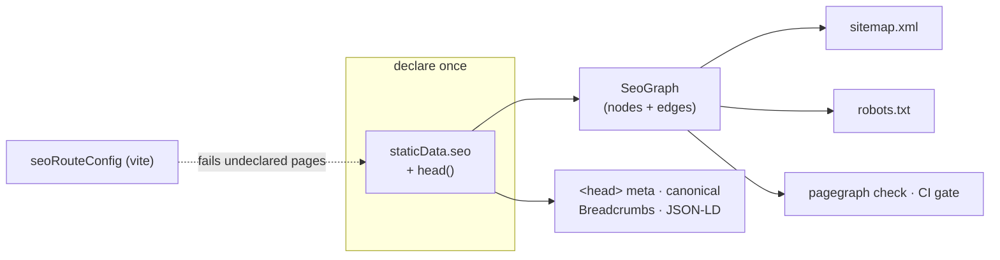

# pagegraph

Route-declared SEO for TanStack Router. Each route declares its SEO policy once, in
`staticData.seo` — the sitemap, `robots.txt`, breadcrumbs, JSON-LD, cross-links, and
the CI check all derive from that one declaration. There is no second place to update,
so nothing drifts. A public page that ships without a declaration **fails the build**.



## Install

```bash
bun add pagegraph
bun add -D lighthouse   # only for `pagegraph audit` performance evidence
```

| Entry                        | Exports                                                                                        | Peers                                       |
| ---------------------------- | ---------------------------------------------------------------------------------------------- | ------------------------------------------- |
| `pagegraph`        | `buildSeoGraph`, `renderSitemap`, `renderRobots`, `contentSignal`, `checkGraph`, `checkRenderedCoverage`, `decodeRenderedEdgeArtifact`, `inspectHtml` | —                                           |
| `pagegraph/react`  | `createSeo` → `seoHead`, `Breadcrumbs`, JSON-LD generators                                     | `react`, `@tanstack/react-router`           |
| `pagegraph/vite`   | `seoRouteConfig` coverage gate                                                                 | `vite`                                      |
| `pagegraph/config` | `defineSeoConfig`, `viteGraphLoader`, `selectPageHeadNodes`, `pageHeads`, `loadPageHeads`                                                           | `vite`                                      |
| `pagegraph/audit`  | Audit services, scanner protocol, rules, and report schemas                                    | `effect`                                    |
| `pagegraph` bin                   | CLI over the same graph                                                                        | bundled — runs on Bun                        |

The core and React import graphs have **zero runtime dependencies** — everything they use is a
peer, and only the entries you import need those peers loaded.

The CLI **bundles PageGraph's Effect and TypeSafe provider runtime**, so it does not depend on the
app's Effect version; it runs on [Bun](https://bun.sh) (`bunx pagegraph`). Agentic workflows load the
OpenCode SDK only when invoked. The first workflow installs pinned OpenCode 2.0.22 into
`~/.cache/pagegraph/opencode-2.0.22-2`, outside the app's dependency tree; subsequent workflows
reuse the verified cache. This keeps consumer dependency overrides away from OpenCode's declared
Effect and Drizzle versions. Executor plugins must use OpenCode's Effect version (`4.0.0-rc.112`).
Bun and network access to npm are required for the first install. The pinned OpenCode client's
HTTP error handling retains the method, path, status, and response body for diagnostics;
undeclared error bodies are capped at 16 KiB.
Discovery-only research gets one continuation to complete provider evidence. Every workflow failure
after run creation writes `failure.json` in the run directory, with the stage, session ID when available,
transcript, and cause chain. `vite` stays a peer — graph commands
load your app through Vite at runtime — and `lighthouse` is only needed by `pagegraph audit`.
Importing `pagegraph/audit` programmatically needs `effect@^4.0.0`. The Effect and TypeSafe
peers remain optional for other library entry points and the bundled CLI.

### Agent skill

The Pagegraph CLI serves its bundled TanStack Start integration skill:

```bash
pagegraph skills list
pagegraph skills get core
```

The skill is maintained at [skill-data/core/SKILL.md](skill-data/core/SKILL.md) and compiled into the CLI, so the instructions match the installed Pagegraph version. `skills get core` prints Markdown to stdout; `--json` returns a structured payload.

## Quick start

**1. Bind your site identity once.** Route files never see an origin or a brand name.

```ts
// lib/seo.ts
import { createSeo } from "pagegraph/react";

export const { seoHead } = createSeo({
  origin: "https://example.com",
  site: {
    name: "Example",
    logo: "/logo.png",
    publisherLogo: "/publisher.png",
    defaultImage: "/og.png",
    defaultAuthor: { name: "Example Team" },
  },
  organization: {
    legalName: "Example, Inc.",
    description: "What the company does.",
    sameAs: ["https://github.com/example"],
    contactPoint: { contactType: "support", email: "hi@example.com" },
    address: {
      streetAddress: "123 Example Street",
      addressLocality: "Example City",
      addressRegion: "CA",
      postalCode: "94105",
      addressCountry: "US",
    },
  },
  website: { searchPath: "/docs?q={search_term_string}" },
});
```

**2. Declare on the route.** Policy in `staticData.seo`, per-page content in `head()`.

```tsx
export const Route = createFileRoute("/pricing")({
  staticData: {
    seo: {
      kind: "page",
      crumb: "Pricing",
      sitemap: { priority: 0.9, changeFrequency: "weekly" },
      related: ["/features", "/docs"],
      link: { title: "Pricing", description: "Simple volume pricing." },
      modifiedAt: "2026-09-29", // sitemap <lastmod> and the freshness report
    },
  },
  head: (ctx) =>
    seoHead(ctx, {
      title: "Pricing — Example",
      description: "Simple volume pricing.",
    }),
});
```

`seoHead` returns the `meta` + canonical `links` TanStack renders into `<head>` —
title, description, og/twitter cards, robots, and the JSON-LD each page warrants
(BreadcrumbList always; Article, FAQPage, Service, ItemList when the instance
declares them).

### Extensible JSON-LD

The built-in generators are conveniences, not a closed schema registry. Define any
`schema-dts` entity, link it to the plugin's stable site identities, and compose one
site graph:

```ts
import {
  createSeo,
  defineJsonLd,
  extendJsonLd,
  jsonLdRef,
} from "pagegraph/react";

export const seo = createSeo({
  // site, organization, and website as above
  jsonLd: {
    site: (ids) => [
      defineJsonLd({
        "@type": "SoftwareApplication",
        "@id": "https://example.com/#product",
        name: "Example",
        applicationCategory: "DeveloperApplication",
        operatingSystem: "Web",
        provider: jsonLdRef(ids.organization),
      }),
    ],
    transform: (entry) => {
      if (entry.kind === "organization") {
        return extendJsonLd(entry.document, {
          slogan: "Ship with confidence.",
        });
      }
      return entry.document;
    },
  },
});

const siteGraph = seo.generateSiteGraphSchema();
```

`generateSiteGraphSchema()` includes Organization, WebSite, and configured site
entities in one `@graph`. Organization and WebSite use stable `#organization` and
`#website` IDs; articles and services provided by the site reference the same
Organization. Existing individual generators remain available and are not transformed.

Add page-specific entities through `seoHead`:

```ts
head: (ctx) =>
  seo.seoHead(ctx, {
    title: "Example for developers",
    description: "A focused description of the product.",
    jsonLd: [
      defineJsonLd({
        "@type": "SoftwareApplication",
        name: "Example",
        url: "https://example.com/product",
      }),
    ],
  });
```

The transform sees discriminated generated and custom entries plus `origin`,
`canonical`, and `entityIds`. Return the document to keep it, no value (or `false`)
to suppress it, or an array to expand it. Output preserves caller order and never
silently deduplicates entities.

**3. Serve the projections.** Build the graph from your route tree, render strings.

```ts
// lib/seo/graph.ts — also the module the CLI loads
import { buildSeoGraph } from "pagegraph";

export const loadSeoGraph = () =>
  buildSeoGraph({ routeTree, collections: [blogCollection] });
```

```ts
// routes/sitemap[.]xml.ts — robots[.]txt.ts is symmetric
import { renderRobots, renderSitemap } from "pagegraph";

renderSitemap(loadSeoGraph(), { origin, indexable: true });
renderRobots(loadSeoGraph(), {
  origin,
  indexable: true,
  disallow: routeConfig.robotsExclusions,
  contentSignal: "search=yes, ai-input=yes, ai-train=yes",
});
```

`renderRobots` does not invent a Content-Signal. Pass `contentSignal` for
the value (the plugin prefixes `Content-Signal: `), `directives` for extra
group lines, and `transform` if you need to wrap or replace the whole file.
Preview hosts (`indexable: false`) drop `contentSignal` and `directives`;
`transform` still runs.

**4. Gate CI.** The same graph, the same rules, exit 1 on structural violations.

```bash
pagegraph check
```

## Agentic workflows

PageGraph can combine the deterministic route graph with a project-owned embedded OpenCode agent,
live tools exposed by an Executor plugin, and Jev decisions. Scaffold the OpenCode preset once:

```bash
pagegraph init
```

The generated `.pagegraph/opencode` directory contains one `seo` agent and customizable `content`,
`technical`, and `authority` skills. Add your Executor plugin to its `opencode.jsonc`; OpenCode and
the plugin own model and Executor authentication. PageGraph does not copy credentials or assume
fixed provider-tool addresses.

Enable workflows in `seo.config.ts`:

```ts
export default defineSeoConfig({
  // origin, disallow, and loadGraph as above
  workflows: {
    opencode: {
      configDirectory: ".pagegraph/opencode",
      defaultModel: "openrouter/example/model",
      // Optional per-completion budget in milliseconds; default 180000.
      timeoutMs: 360_000,
      models: {
        "research.keywords": "openrouter/example/research-model",
      },
    },
    context: {
      files: ["AGENTS.md"],
      byWorkflow: {
        "research.keywords": ["docs/seo/measurement.md"],
      },
    },
    runsDirectory: ".pagegraph/runs",
  },
});
```

Run a page-backed workflow:

```bash
pagegraph research keywords \
  --query "transactional email api" \
  --market us \
  --language en
```

Every workflow starts from the selected graph and context files, asks the SEO agent to search
Executor's live catalog and inspect the discovered tools' argument schemas, then evaluates its
structured observations with Jev. Tool paths are discovered at runtime; the generated skills contain
editable starter recipes, not a fixed integration list.

`workflows.opencode.timeoutMs` sets the positive integer deadline in milliseconds for each OpenCode
completion (maximum `2147483647`). It covers prompt admission, model execution, and any workflow JSON
repair prompt. A later action or continuation turn gets a separate budget. The default is `180000`.

Selecting pages preserves their incoming and outgoing relationships to non-selected pages in
`evidence.neighborhood`. Those neighbors supply architecture context without becoming workflow
targets or consuming `--limit`. The agent receives the limit before research, and PageGraph also caps
the decoded result before decisions.

After research is validated, the run directory contains `research.json`: an incomplete checkpoint
with the collected evidence, decision inputs, and OpenCode transcript. A downstream failure reports
its path so the evidence remains available for diagnosis. Only a completed workflow writes
`run.json` and `summary.md`; a research checkpoint is not a final recommendation.
Model JSON drops null properties and array elements before validation. Schema validation collects all
issues for one read-only repair turn. Every error after run creation writes `failure.json` in that
run directory with the workflow, stage, available OpenCode session ID, transcript, and full cause
chain. The error reports the artifact path and a next step; a failed artifact write preserves the
original error with a note.

| Command | Result |
| --- | --- |
| `research keywords` | Query demand, intent, and page ownership opportunities |
| `research competitors` | Competitor topics, pages, and positioning evidence |
| `research authority` | Qualified editorial, directory, partner, and community opportunities |
| `analyze serp` | Search-result intent and page-shape fit |
| `analyze content` | Substance, answer quality, and intent overlap |
| `analyze ai-search` | Citation readiness and answer-engine coverage |
| `plan architecture` | A page-backed information-architecture plan |
| `improve content` | Evidence-backed source copy edits |
| `improve metadata` | Title and description edits at the owning source |
| `improve schema` | Structured-data edits justified by visible content |
| `improve links` | Contextual internal-link edits from graph and page evidence |

The common selectors are repeatable `--page`, `--query`, and `--kind`, plus `--limit`, `--market`,
`--language`, `--refresh`, `--model`, `--opencode-config`, and `--out`. Relevant workflows also
accept `--competitor`, `--domain`, or `--device desktop|mobile`. Workflows are noninteractive and
fail immediately if the agent asks a question or requests permission.

The four `improve` workflows write source files by default and require a clean Git tree. Use
`--dry-run` to keep repository edit and shell tools disabled, or `--allow-dirty` when you explicitly
want the agent to edit alongside existing changes. PageGraph leaves every diff uncommitted and
records modified, added, and deleted files after the workflow finishes.

Each run writes `.pagegraph/runs/<run-id>/run.json` and `summary.md`. The JSON retains the
deterministic graph, context, complete OpenCode session export, Executor tool evidence, Jev question
definitions and answers, Git provenance, changed files, and model provenance. Keep this directory
ignored: provider output can be large or account-specific. Workflows fail when the configured model,
active Executor plugin, catalog search plus discovered tool call, or `TYPESAFE_API_KEY` for Jev is
unavailable.

## Typed paths

Augment `Register` (the same pattern TanStack Router uses) and `related` /
`redirectTo` are typed against your real route tree — a renamed route becomes a
compile error, not a dead link:

```ts
declare module "pagegraph" {
  interface Register {
    paths: FileRouteTypes["fullPaths"];
    kinds: "page" | "article" | "hub";
  }
}
```

## The graph

`buildSeoGraph` walks the route tree and produces nodes (one per public URL) and
typed edges: `crumb-parent` (breadcrumb ancestry), `related` (deliberate
cross-links), `redirect`, and `collection-member`.

Dynamic pages — blog posts rendering through `/blog/$slug` — enter as
**collections**. Instances inherit the param route's declared policy, so
declarations stay the single source of truth:

```ts
const blogCollection: SeoCollection = {
  route: "/blog/$slug",
  source: "blog",
  instances: posts.map((p) => ({
    path: `/blog/${p.slug}`,
    title: p.title,
    description: p.description,
    publishedAt: p.date,
  })),
};
```

`checkGraph` runs every rule against the graph and returns violations at two
severities:

- **structural** — internally broken declarations; these fail `pagegraph check` (exit 1):
  dead or duplicate edges, path collisions, a redirect in the sitemap, a
  sitemap/noindex contradiction, a `related` target with no `link` card, an
  instance without a title, a date that is not ISO 8601, or an unmet
  contextual-link coverage rule.
- **editorial** — quality smells, reported but non-failing: duplicate or mis-sized
  titles and descriptions, and pages older than the freshness policy.

Each sitemap entry's `<lastmod>` is the page's last declared change: an
instance's `modifiedAt`, else its `publishedAt`; a route's `modifiedAt`. A param
route's date is never inherited by its instances. Undated pages emit no
`<lastmod>`.

## Coverage gate (Vite)

`seoRouteConfig` parses the route tree with `@tanstack/router-generator` (the same
parser as the router) and fails `vite build` when a page in an enforced group has
neither `staticData` nor `head`:

```ts
// vite.config.ts
import { seoRouteConfig } from "pagegraph/vite";

seoRouteConfig({
  outputPath: fileURLToPath(new URL("./lib/route-config.ts", import.meta.url)),
  publicGroups: ["(marketing)", "(docs)"],
  enforceCoverageIn: ["(marketing)", "(docs)"],
  alwaysDisallow: ["/dashboard", "/api"],
});
```

It also derives a small config module from the route tree: `robotsExclusions`
(feed to `renderRobots`) and `reservedSegments` (top-level segments an app must
not hand out as tenant/org slugs).

## CLI

The graph commands acquire your graph through `seo.config.ts` at the app root —
the `viteGraphLoader` evaluates your graph module inside a headless Vite server,
so path aliases, content plugins, and virtual modules all resolve:

```ts
// seo.config.ts
import { defineSeoConfig, viteGraphLoader } from "pagegraph/config";

export default defineSeoConfig({
  origin: "https://example.com",
  disallow: routeConfig.robotsExclusions,
  contentSignal: "search=yes, ai-input=yes, ai-train=yes",
  // Fail `check` unless each named money page has enough contextual links.
  coverage: [{ path: "/pricing", minInbound: 2 }, { path: "/features/*", minInbound: 1 }],
  loadGraph: viteGraphLoader({
    root: import.meta.dirname,
    entry: "/lib/seo/graph.ts",
    exportName: "loadSeoGraph",
  }),
});
```

`viteGraphLoader<Input>(options)` returns a loader whose JSON input is passed to
its entry export. Existing zero-argument loaders remain valid. The host resolves
framework-specific route `head()` values into node instances; pagegraph selects
and validates the resulting plain metadata:

```ts
import { loadPageHeads, viteGraphLoader } from "pagegraph/config";

const loader = viteGraphLoader<{ exclude: string[] }>({
  root: import.meta.dirname,
  entry: "/lib/seo/graph.ts",
  exportName: "loadHeadGraph",
});
const exclude = ["/docs", "/docs/**", "/captured-page"];
const heads = await loadPageHeads(() => loader({ exclude }), { exclude });
```

`selectPageHeadNodes(graph, options)` selects nodes before host metadata resolution.
`pageHeads(graph, options)` returns `{ path, title, description }[]`, requiring
nonblank titles and descriptions and naming the page on failure. `loadPageHeads`
always disposes the acquired graph, including when validation fails. Page nodes
carry a sitemap declaration or an instance; layouts are excluded. By default,
selection excludes noindex pages, redirects and parameter templates, while retaining
sitemap-disabled hubs. Set `indexable: false` to include those nonindexable nodes.
`exclude` accepts exact paths and path globs (`*` within a segment, `**` across
segments). Docs are ordinary pages; excluding them is caller policy, not a graph kind.

```bash
pagegraph check                 # CI gate — exit 1 on structural violations
pagegraph check --site <url>    # also check every declared page's rendered HTML
pagegraph stale                 # refresh queue: sitemap pages past the freshness policy
pagegraph graph                 # the graph as a tree · --format mermaid | json
pagegraph inspect /pricing      # one node: policy, sitemap status, in/out edges
pagegraph inspect <url> --live  # fetch a deployed page, validate its rendered <head>
pagegraph links verify <url>    # crawl served HTML: depth, orphans, declared-vs-rendered
pagegraph links verify <url> --assert-coverage  # also assert seo.config.ts coverage on served anchors
pagegraph links verify <url> --emit-rendered <file>  # save the rendered edge set
pagegraph links candidates      # propose contextual links from the declared graph
pagegraph research keywords --query "email api"  # combine graph, Executor, and Jev evidence
pagegraph improve metadata --page /pricing       # apply a clean-tree source improvement
pagegraph sitemap               # print sitemap.xml
pagegraph robots                # print robots.txt
```

Stdout is data, stderr is status — `pagegraph check --json | jq` just works.

### Verify the rendered link graph

`pagegraph links verify` crawls a site's served HTML — through the same DNS-pinned,
private-IP-blocked HTTP path as `pagegraph audit` — and reports what a crawler
actually receives: the real homepage depth, the pages with no incoming internal
edge (rendered orphans), and, when the app has a `seo.config.ts`, the
declared-vs-rendered link diff. It is bounded with `--limit` and needs no
framework or config. Discovery reads same-origin `robots.txt` and bounded
sitemaps before following page anchors, so a sitemap-only page can appear as an
orphan. The JSON `crawl` block records skipped URLs, discovery failures, and
sitemap truncation. Link-followed non-HTML alternates are recorded in `nonHtml`
without counting as HTML page failures; a sitemap-listed or declared page served
as non-HTML still blocks a coverage assertion:

```bash
pagegraph links verify https://example.com
pagegraph links verify https://example.com --limit 25 --json | jq
```

`--emit-rendered <path>` writes the crawl's raw edge set as a versioned artifact,
and `--rendered <path>` replays one instead of crawling — so a single crawl can be
asserted repeatedly in CI without re-fetching:

```bash
pagegraph links verify https://example.com --emit-rendered .seo/rendered.json
pagegraph links verify --rendered .seo/rendered.json --json | jq
```

The artifact preserves every anchor's `region` (`body` vs `nav`/`footer`/`header`)
and the provenance a gate needs to trust it:

```jsonc
{
  "kind": "links-rendered",
  "schemaVersion": 1,
  "origin": "https://example.com",
  "seed": "https://example.com/",
  "crawl": {
    "pages": 42,
    "root": "/",
    "limit": 100,
    "truncated": false,
    "bodyTruncated": false,
    "truncatedPages": [],
    "failures": [],
    "nonHtml": [{ "url": "https://example.com/auth.md", "finalUrl": "https://example.com/auth.md", "contentType": "text/markdown" }],
    "discoveryFailures": [],
    "skipped": [],
    "sitemapTruncated": false,
    "sitemapUsed": true,
  },
  "nodes": ["/", "/pricing"],
  "edges": [{ "from": "/", "to": "/pricing", "region": "body" }],
}
```

It is also a drop-in input for `pagegraph links candidates --rendered`.

### Assert coverage on the rendered graph

`pagegraph check` evaluates the `seo.config.ts` `coverage` rules against the
**declared** graph; `pagegraph links verify --assert-coverage` evaluates the same
rules against the anchors a crawler **actually receives**. Only same-origin
body-region anchors count — nav, header, and footer links are chrome — which is
the served analogue of `check` counting `related` edges alone. The rule's target
universe is still the declared graph's sitemap-eligible pages.

```bash
pagegraph links verify https://example.com --assert-coverage
pagegraph links verify --rendered .seo/rendered.json --assert-coverage --json | jq
```

The command exits non-zero when any rule is unmet, and **refuses to assert** (also
non-zero) rather than reporting a false pass when the crawl outran `--limit`, a
page failed to fetch (its anchors are missing), a body hit `--max-body-bytes`, the
robots or sitemap discovery is incomplete, the
config declares no `coverage`, or the artifact's origin differs from
`seo.config.ts`. Under `--assert-coverage` the report gains a `coverage` block
(`{ rules, ok, violations }`); the default `--json` summary is unchanged.

### Propose contextual links

`pagegraph links candidates` reads the declared graph and proposes
`(source, destination)` pairs that are plausible contextual links and not already
connected. Pages are grouped into clusters — a shared top-level section, or the
same `kind` for root-level pages — and only sitemap-eligible pages are proposed.
Each direction is evaluated separately. A declared `related` edge or served
body-region anchor excludes only its own direction. Nav, header, and footer
anchors do not exclude contextual suggestions. `--rendered` accepts a JSON dump
of already-served anchors (`[{ from, to, region }]` or `{ edges: [...] }`).
Legacy edges without a `region` are treated as body links.

The output is a deterministic, reviewable plan: human text by default and
versioned JSON with `--json`. Nothing is applied; `--limit` and `--cluster`
bound the plan. Use `pagegraph improve links` when you want Executor evidence,
Jev evaluation, and source edits:

```bash
pagegraph links candidates
pagegraph links candidates --cluster blog --limit 20
pagegraph links candidates --rendered rendered.json --json | jq
pagegraph improve links --page "/docs/**"
```

For content-backed placements, opt in to a bounded same-origin probe. The configured
`origin` must match `--site`. Each schema-version-2 result carries a sentence
from served main content, an exact anchor phrase inside it, a target sentence,
and score components. Unreadable and over-limit pages are reported as skipped.
Code samples and tabular comparisons are excluded. An anchor is proposed only
when its distinct content words occur together in a target sentence, so review
the placement and its context before editing. Repeated passages and clause
fragments are excluded; named destinations require a destination-specific anchor.
The home and about pages are omitted as destinations because site navigation already leads there.
The pair-only command above remains offline and emits schema version 1.
The page budget selects low-inbound candidate pairs first. Use repeatable
`--target /exact/path` to put a known weak destination within the budget. Add
`--source /exact/path` when you have a likely source and want to guarantee the
pair is probed even on a large site; raise `--page-limit` for more pairs.
For a site with many legal, comparison, or other low-inbound pages, use
`--cluster blog` (or another section) to spend the same page budget on an
editorial cluster. A zero-result broad probe means no placement passed the
evidence rules within its selected pages; it does not mean the whole site has
no possible links.

```bash
pagegraph links verify https://example.com --json
pagegraph links candidates --site https://example.com --page-limit 25 --json > /tmp/pagegraph-suggestions.json
pagegraph links candidates --site https://example.com --cluster blog --page-limit 25 --json
pagegraph links candidates --site https://example.com --source /blog/guide --target /blog/weak --page-limit 25 --json > /tmp/pagegraph-suggestions.json
pagegraph improve links --suggestions /tmp/pagegraph-suggestions.json --dry-run
pagegraph improve links --suggestions /tmp/pagegraph-suggestions.json
```

`improve links` validates the artifact against the configured origin and graph,
then asks Jev to judge the suggested placements. Only accepted `add` or `update`
decisions can open an edit turn; skipped and review-band links remain in the run
artifact without authorizing an edit. Before an accepted edit, Pagegraph checks
that the source sentence and target passage still occur in served copy. Regenerate
the artifact if either page changed. For a local site, pass `--allow-private` to
both `links candidates --site` and `improve links --suggestions`.

### Contextual-link coverage

Declare a contextual-link coverage policy in `seo.config.ts` (a `coverage` array
of `{ path, minInbound }`), or pass repeatable `--require-inbound "<path-glob>=<n>"`
flags to override it for one run. `pagegraph check` then fails (exit 1) unless
every sitemap-eligible page matching the glob has at least `minInbound` incoming
`related` edges. `*` matches within a path segment and `**` crosses segments; a
rule that matches no sitemap-eligible page is itself a violation.

```bash
pagegraph check --require-inbound "/pricing=2" --require-inbound "/features/*=1"
```

`pagegraph check` asserts the policy on the declared graph. To prove the links are
actually served, assert the same policy on the rendered graph — see
[Assert coverage on the rendered graph](#assert-coverage-on-the-rendered-graph).

### Check rendered content

The declared graph cannot see what a page renders: headings come from
components, and the `<title>`, JSON-LD, and visible text are composed at render
time. `pagegraph check --site <url>` fetches every sitemap-eligible page (and
every concrete page that declares `noindex`) from a running server and checks
the server-rendered HTML — what a crawler receives before any script runs. A
server error or failed request is retried once, because a dev server's first
render of a route can fail while it compiles.

```bash
pagegraph check --site http://localhost:3000 --allow-private
pagegraph check --site https://staging.example.com --json | jq '.violations'
```

| Rule | Severity | Fails when |
| --- | --- | --- |
| `rendered-page-unavailable` | structural | The page errors, is not HTML, is truncated, or redirects off its declared path |
| `rendered-robots-mismatch` | structural | An indexable page renders a `noindex` robots meta, or a `noindex` declaration renders none |
| `rendered-canonical-mismatch` | structural | The canonical is missing or its path is not the declared path |
| `missing-h1`, `multiple-h1`, `empty-h1` | structural | The page does not have exactly one H1 with text |
| `faq-not-visible` | structural | A FAQPage question or answer is not in the rendered text |
| `offer-price-not-visible` | structural | An Offer or AggregateOffer price does not appear on the page |
| `heading-level-skip` | editorial | The main-content outline skips a level (h2 → h4) |
| `h1-title-mismatch` | editorial | The H1 and `<title>` share no significant term |
| `webpage-head-mismatch` | editorial | A WebPage `name` or `description` disagrees with the head |
| `thin-content` | editorial | Main content is under the page's `content.minWords` floor |

Google requires structured data to describe content the page visibly shows, so
a FAQ answer that exists only in JSON-LD or in hydration data (an accordion that
mounts answers on open, say) is structural. Comparisons ignore punctuation,
case, and markup; prices match as numbers (`19` matches `$19/mo` and `19.00`,
not `$199`). Canonicals compare by path, and robots are read from the meta tag
only, so a local or preview host that sends `X-Robots-Tag: noindex` everywhere
can still run the check.

Word-count floors are project policy, declared per path glob; a page matching
several rules must meet the highest:

```ts
export default defineSeoConfig({
  // ...
  content: {
    minWords: [
      { path: "/blog/*", minWords: 500 },
      { path: "/compare/*", minWords: 800 },
    ],
  },
});
```

`pagegraph audit` runs the heading and structured-data rules on every audited
HTML page too. The robots, canonical, and word-count rules need the declared
graph, so they stay in `check`.

### Freshness

Declare a freshness policy to turn old pages into editorial `stale-page`
findings in `pagegraph check`, and list the refresh queue with `pagegraph stale`:

```ts
export default defineSeoConfig({
  // ...
  freshness: { maxAgeDays: 90 },
});
```

```bash
pagegraph stale                     # stale pages, oldest first; undated pages counted
pagegraph stale --max-age-days 180 --json
```

Only sitemap-eligible pages are judged. A page without a date is reported as
undated rather than stale; give content its `modifiedAt` (or a route its
`staticData.seo.modifiedAt`) to bring it into the report and the sitemap's
`<lastmod>`.

### Audit any website

`pagegraph audit` is framework-independent and does not need `seo.config.ts`. It
validates target URLs before making requests, follows redirects through the same
validation boundary, inspects the rendered document and discovery files, and
can collect Lighthouse evidence through a validating proxy.

```bash
pagegraph audit https://example.com
pagegraph audit https://example.com https://example.com/docs --json | jq
pagegraph audit https://localhost:3000 --allow-private --probe-only
```

The report keeps evidence and findings separate: scanners collect observations;
pure rules classify structural failures and editorial quality issues. One failed
scanner does not erase successful evidence from the others. JSON mode emits one
versioned document on stdout, while diagnostics and artifact paths stay on
stderr.

Use `--probe-only` when Lighthouse is unavailable or unnecessary. Private and
reserved destinations are rejected unless `--allow-private` is explicit; that
flag is intended for local development and CI fixtures.

### Compare audit artifacts

Write timestamped reports from two revisions, then compare their semantic SEO
outcomes without failing on timestamps, timing, or other raw scanner evidence:

```bash
pagegraph audit https://example.com --output-dir .audit/before
# deploy or check out the next revision
pagegraph audit https://example.com --output-dir .audit/after
pagegraph diff .audit/before/<report>.json .audit/after/<report>.json
pagegraph diff .audit/before/<report>.json .audit/after/<report>.json --json | jq
```

| Change | Outcome | Exit |
| --- | --- | ---: |
| Timestamp, warning text, or raw scanner evidence only | `unchanged` | 0 |
| Editorial finding or improvement | `changed` | 0 |
| Structural finding, scanner degradation, or lost coverage | `regressed` | 1 |

Inputs must satisfy the published `AuditReport` schema version 1. JSON mode
emits a separately versioned `audit-diff` document even when a regression makes
the command exit 1; operational and schema failures write only to stderr.

Raw scanner evidence remains in the source artifacts but is not interpreted by
the generic comparator. Performance gates should be expressed as scanner
findings with explicit thresholds rather than inferred from volatile Lighthouse
measurements. Finding payloads (`message`, `fix`, `observed`, and `expected`)
remain semantic: same-severity changes are reported as non-blocking `changed`
outcomes.

## Testing

Everything the CLI checks is a pure function you can call from a test:

```ts
import {
  checkGraph,
  checkPageContent,
  extractPageContent,
  hasStructuralViolations,
  inspectHtml,
} from "pagegraph";

expect(hasStructuralViolations(checkGraph(loadSeoGraph()))).toBe(false);

// render a page however you like, then assert the head it actually ships
const report = inspectHtml(url, 200, html);
expect(report.issues).toEqual([]);

// …and the content it ships: one H1, visible FAQ answers, shown prices
expect(checkPageContent(extractPageContent(html))).toEqual([]);
```

## TanStack Start example

The [TanStack Start cookbook](./examples/tanstack-start/README.md) shows the complete wiring in
one place: route-declared metadata, the graph loader, sitemap and robots projections, JSON-LD,
the Vite coverage gate, and the CLI inspection and `pagegraph diff` workflow. It is intentionally
framework-neutral beyond the Start route seams, so you can copy the modules into an existing
Start app and keep your own route tree and content collections.

## License

MIT
