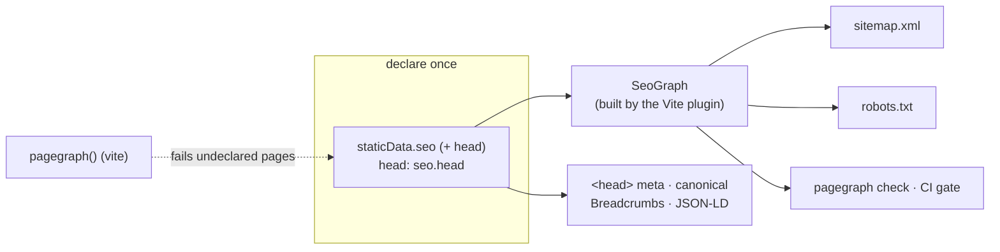

# pagegraph

Route-declared SEO for TanStack Start and TanStack Router. Each route declares its SEO
policy and head once, in `staticData.seo` — the `<head>`, sitemap, `robots.txt`,
breadcrumbs, JSON-LD, cross-links, and the CI check all derive from that one
declaration. There is no second place to update, so nothing drifts. A public page that
ships without a declaration **fails the build**.



## Install

```bash
bun add pagegraph
bun add -D lighthouse   # only for `pagegraph audit` performance evidence
```

## Authored pages

Keep authored text beside its React layout. `DocumentProvider` records only its page body when
supplied a collector; ordinary rendering preserves the layout. `Title` assigns a heading to the
nearest section or item, `Fact` resolves shared values, and `Visual` describes content for the
markdown document without rendering its children during capture.

```tsx
import { renderToStaticMarkup } from "react-dom/server";
import { defineFacts, fact, documentMarkdown } from "pagegraph";
import {
  DocumentProvider, T, Title, Section, Fact, createCollector, finishDocument,
} from "pagegraph/react";

const facts = defineFacts({ attempts: fact.number(8) });
declare module "pagegraph" {
  interface Register { facts: typeof facts }
}

const collector = createCollector({ path: "/email", site: "https://example.com", facts });
const page = (
  <DocumentProvider collector={collector}>
    <Section kind="prose" id="intro">
      <h1><Title>Email delivery</Title></h1>
      <p><T>Retry up to <Fact id="attempts" /> times.</T></p>
    </Section>
  </DocumentProvider>
);
// Your SSR renderer supplies completed HTML, whose markers determine document order.
const html = renderToStaticMarkup(page);
const document = finishDocument(collector, {
  title: "Email delivery", description: "Reliable delivery with retries.",
}, html);
const markdown = documentMarkdown(document, "https://example.com");
```

Use `defineSectionKind` for custom formatting; its markdown writer provides `text`, `heading`,
and `table`:

```ts
import { defineSectionKind } from "pagegraph";
const comparison = defineSectionKind({
  kind: "comparison",
  markdown: (section, md) => md.heading(2, section.title)
    + md.table(section.items.map((item) => item.cells)),
}); // pass kind={comparison} to Section
```

`Section.Item.Link` records a card's destination, while `CaptureAnchor` is the
public anchor boundary for router `createLink` integrations. `ForAgents` and `ForHumans` mark
audience-specific text; markdown excludes human-only content. `messageText` extracts text or
inline markdown for head metadata. The root entry also provides `hashDocument`,
`createMarkdownLock`, and pure `llmsMarkdown`/`llmsSection` string builders.

## Rendered markdown with TanStack Start

Declare rendered pages on the route that owns `DocumentProvider`. Collection instances inherit
these fields from their parameter route; the parameter template itself is never captured.

```tsx
import { createFileRoute } from "@tanstack/react-router";
import { DocumentProvider, Section, T, Title } from "pagegraph/react";
import { Link } from "pagegraph/tanstack-start/react";

export const Route = createFileRoute("/pricing")({
  staticData: {
    seo: { kind: "page", head: { title: "Pricing", description: "Plans for your team." } },
    markdown: "rendered",
    llms: "Product",
  },
  head: () => ({ meta: [{ title: "Pricing" }, { name: "description", content: "Plans for your team." }] }),
  component: () => (
    <DocumentProvider>
      <Section kind="prose" id="plans">
        <h1><Title>Plans for your team</Title></h1>
        <Link to="/"><T>Back home</T></Link>
      </Section>
    </DocumentProvider>
  ),
});
```

`markdown: "source"` identifies pages whose Markdown is supplied by the application; pagegraph
captures only `"rendered"` pages. `llms` sets an optional llms.txt group. Use the capture-aware
`Link` for authored links: it uses TanStack's ordinary Link outside a capture and records resolved
anchor destinations during capture. The plugin adds `source=` locations to authored JSX imported
from `pagegraph/react`. In development, `DocumentProvider` rejects a current route lacking
`staticData.markdown: "rendered"`.

Configure the plugin and pass its fixed capture page to Start:

```ts
import { pagegraph } from "pagegraph/tanstack-start";

const graph = pagegraph({
  origin: "https://preview.example.com", // this deployment's SEO origin
  collections: "src/collections.ts",
  markdown: {
    origin: "https://example.com", // canonical document and twin links
    serverEntry: "dist/server/index.js", // default; relative to the Vite root
  },
  facts: "src/facts.ts", // exports `facts`; evaluated in the pagegraph environment
});

// In your Vite plugins:
// tanstackStart({
//   prerender: { enabled: true, autoStaticPathsDiscovery: false, crawlLinks: false, failOnError: true },
//   pages: [...graph.prerenderPages],
// }), graph
```

For Cloudflare, wire the non-deployed prerender Worker to the compiled Start server. Add this to
`cloudflare()` alongside the production Worker's configuration:

```ts
experimental: {
  prerenderWorker: {
    config: {
      name: "app-markdown-prerender",
      main: "pagegraph/tanstack-start/prerender-worker",
      compatibility_date: "2026-09-20",
      compatibility_flags: ["nodejs_compat"],
      vars: { TSS_PRERENDERING: "true" },
      assets: { binding: "ASSETS", run_worker_first: true },
    },
  },
},
```

Call the capture adapter before your normal Start handler, forwarding the same request options:

```ts
import handler from "@tanstack/react-start/server-entry";
import { markdownRequest } from "pagegraph/tanstack-start/markdown";

export default {
  async fetch(request: Request) {
    return await markdownRequest(request) ?? handler.fetch(request);
  },
};
```

Only dev and the prerender Worker capture documents. `GET` and `HEAD` on
`/__pagegraph/markdown.json` capture all rendered pages; `/pricing.md` and
`/pricing.document.json` capture one page in dev. Ordinary requests return `null`. In production,
private capture paths return 404 and Markdown twins fall through to your static asset server.
`markdownPagePaths()` exposes the concrete rendered page paths.

After prerender, the plugin writes `dist/client/pricing.md` (`/` becomes `index.md`),
`.pagegraph/documents/pricing.json`, and `.pagegraph/heads.json`, and removes the emitted private
capture response. Stale valid documents at their derived paths are pruned; unrelated files are
preserved. Ignore the private generated documents and heads in Git. Claims replay is reserved for
a separate integration.

Serve graph-derived llms.txt without rendering pages:

```ts
import { createFileRoute } from "@tanstack/react-router";
import { llmsTxt } from "pagegraph/tanstack-start/server";

export const Route = createFileRoute("/llms.txt")({
  server: { handlers: { GET: llmsTxt({ sections: ["## Docs\n\nRead our documentation."] }) } },
});
```

`llmsSection()` returns the generated section for custom composition. It includes rendered twins
and explicitly grouped pages, using graph titles and descriptions and `markdown.origin`.

## What runs where

Every entry belongs to one place. Runtime entries use portable graph and document code with
the framework peers listed below; the capture adapter runs on a Start server. Build entries
load your app through Vite, parse routes natively, or drive Node I/O.

| Entry              | Runs in                       | Exports                                                                                                   | Peers                             |
| ------------------ | ----------------------------- | --------------------------------------------------------------------------------------------------------- | --------------------------------- |
| `pagegraph`        | runtime (Worker, SSR, browser) | `buildSeoGraph`, `contentCollection`, `renderSitemap`, `renderRobots`, `pageHeads`, `graphToJson`/`graphFromJson`, checks, `inspectHtml`, document types, facts, markdown and locks | —                                 |
| `pagegraph/react`  | runtime                       | `createSeo` → `seo.head`, `seoHead`, `Breadcrumbs`, JSON-LD generators, authored page primitives                                    | `react`, `@tanstack/react-router` |
| `pagegraph/tanstack-start/server` | runtime (Start server routes) | `robotsTxt`, `sitemapXml`, `llmsTxt`, `llmsSection`, `seoGraph`, `seoSite`                                           | the `pagegraph()` plugin          |
| `pagegraph/tanstack-start/markdown` | runtime (Start server) | `markdownRequest`, `markdownPagePaths` | `react`, `react-dom`, `@tanstack/react-start`, `@tanstack/react-router` |
| `pagegraph/tanstack-start/react` | runtime | capture-aware `Link` | `react`, `@tanstack/react-router` |
| `pagegraph/tanstack-start/prerender-worker` | non-deployed prerender Worker | compiled Start server | the `pagegraph()` plugin |
| `pagegraph/tanstack-start` | build (`vite.config.ts`, `pagegraph.config.ts`) | `pagegraph()` Vite plugin, `tanstackStartGraph`, `evaluateAppGraph`                        | `vite`, `@tanstack/router-generator`, `effect` |
| `pagegraph/vite`   | build (`vite.config.ts`)      | `seoRouteConfig` coverage gate                                                                            | `vite`, `@tanstack/router-generator` |
| `pagegraph/config` | build (`pagegraph.config.ts`, CLI)  | `defineSeoConfig`, `viteGraphLoader`, `loadPageHeads`                                                     | `vite`                            |
| `pagegraph/claims` | build / CLI (Node or Bun) | `claimsInput`, `claimsFamily`, document resolution, committed claims checks | `effect` |
| `pagegraph/audit`  | build / CLI (Node or Bun)     | Audit services, scanner protocol, rules, and report schemas                                               | `effect`                          |
| `pagegraph/oxlint` | build (oxlint)               | `pagegraph` plugin: `no-bare-text`, `t-children`                                                        | —                                 |
| `pagegraph` bin    | CLI (Bun)                     | CLI over the same graph                                                                                   | bundled                           |

Build entries resolve to a stub under the `workerd`, `worker`, and `browser` export conditions.
A Worker or browser bundle that reaches one fails at import with an error naming the entry,
instead of crashing on a native binding when a request first runs the code. The runtime entries
have **zero runtime dependencies** beyond their listed peers; a test pins each entry's import
graph.

The CLI **bundles PageGraph's Effect, TypeSafe provider runtime, and Pi agent runtime**, so it does
not depend on the app's Effect version; it runs on [Bun](https://bun.sh) (`bunx pagegraph`). Every
workflow runs in-process on Pi 1.0.0. Improve workflows use guarded repository edit tools;
research and dry-run actions expose only read tools. Every workflow failure after run creation
writes `failure.json` with its stage, agent messages, and cause chain. `vite` stays a peer — graph commands load your app through Vite at
runtime — and `lighthouse` is only needed by `pagegraph audit`. Importing `pagegraph/audit`
programmatically needs `effect@^4.0.0`. The Effect and TypeSafe peers remain optional for other
library entry points and the bundled CLI.

### Agent skill

The Pagegraph CLI serves its bundled TanStack Start integration skill:

```bash
pagegraph skills list
pagegraph skills get core
```

The skill is maintained at [skill-data/core/SKILL.md](skill-data/core/SKILL.md) and compiled into the CLI, so the instructions match the installed Pagegraph version. `skills get core` prints Markdown to stdout; `--json` returns a structured payload.

## Quick start (TanStack Start)

**1. Bind your site identity once.** Route files never see an origin or a brand name.

```ts
// lib/seo.ts
import { createSeo } from "pagegraph/react";

const site = createSeo({
  origin: "https://example.com",
  site: {
    name: "Example",
    logo: "/logo.png",
    publisherLogo: "/publisher.png",
    defaultImage: "/og.png",
    defaultAuthor: { name: "Example Team" },
  },
  organization: {
    legalName: "Example, Inc.",
    description: "What the company does.",
    sameAs: ["https://github.com/example"],
    contactPoint: { contactType: "support", email: "hi@example.com" },
  },
  website: { searchPath: "/docs?q={search_term_string}" },
});

export const seo = site; // seo.head for static routes
export const { seoHead } = site;
```

**2. Declare each page once.** `staticData.seo` holds the crawl policy and the head
together; `seo.head` renders it. The graph and the checks read the same
`staticData.seo.head` — the page and the graph cannot disagree.

```tsx
export const Route = createFileRoute("/pricing")({
  staticData: {
    seo: {
      kind: "page",
      crumb: "Pricing",
      sitemap: { priority: 0.9, changeFrequency: "weekly" },
      related: ["/features", "/docs"],
      link: { title: "Pricing", description: "Simple volume pricing." },
      modifiedAt: "2026-09-29", // sitemap <lastmod> and the freshness report
      head: {
        title: "Pricing — Example",
        description: "Simple volume pricing.",
        faqs: pricingFaqs,
      },
    },
  },
  head: seo.head,
  component: PricingPage,
});
```

`seo.head` returns the `meta` + canonical `links` TanStack renders into `<head>` —
title, description, og/twitter cards, robots, and the JSON-LD each page warrants
(BreadcrumbList always; Article, FAQPage, Service, ItemList when the head declares
them). A route that renders from `loaderData` calls `seoHead(ctx, instance)` in its
own `head()` and declares a `titleTemplate` (`"%s | Example Blog"`): `seoHead` applies it,
and the graph applies it to the route's collection pages.

**3. Register the plugin.** It builds the graph once per build (and on change in dev)
inside your app's Vite pipeline — path aliases, `define`s, and content plugins such as
Fumadocs apply, with no stubs — and ships it to the server runtime as data.

```ts
// vite.config.ts
import { pagegraph } from "pagegraph/tanstack-start";

pagegraph({
  origin: "https://example.com",
  indexable: process.env.DEPLOY_ENV === "production", // previews disallow everything
  robots: { contentSignal: "search=yes, ai-input=yes, ai-train=yes" },
  collections: "src/lib/seo/collections.ts",
  routeConfig: {
    outputPath: fileURLToPath(new URL("./src/lib/route-config.ts", import.meta.url)),
    publicGroups: ["(marketing)", "(docs)"],
    enforceCoverageIn: ["(marketing)", "(docs)"],
    alwaysDisallow: ["/dashboard", "/api"],
  },
});
```

```ts
// src/lib/seo/collections.ts — evaluated in the app's Vite pipeline
import { contentCollection } from "pagegraph";
import { blogSource } from "../blog-source"; // e.g. a Fumadocs loader()

export const collections = () => [
  contentCollection({
    route: "/blog/$slug",
    source: "blog",
    pages: blogSource.getPages(),
    entry: (page) => ({
      title: page.data.title,
      description: page.data.description,
      publishedAt: page.data.date,
      related: page.data.related,
    }),
  }),
];
```

The plugin evaluates every route file that declares `staticData` — never the generated
route tree — in a Node environment named `pagegraph`. A route that imports a module
only the server runtime provides (`cloudflare:workers`) fails with its file name; add an
app-only route to `exclude` (route-file globs).

### Per-page Open Graph images

Declare an image alongside a static page's title and description:

```ts
head: {
  title: "Pricing — Example",
  description: "Simple volume pricing.",
  image: { url: "/og/pricing.png", width: 1200, height: 630, alt: "Example pricing" },
}
```

For collection pages, return `image` from `contentCollection`'s `entry` mapping and pass the
same value to `seoHead(ctx, { ...head, image })` at render time. Existing `article.image` strings
remain supported. Precedence is `head.image`, then `article.image`, then the resolver.

Share a resolver between the build plugin and the render API so every graph consumer and the
rendered head use the same image:

```ts
// src/lib/seo/og-image.ts
import type { OgImageResolver } from "pagegraph";

export const ogImage: OgImageResolver = (node) => ({
  url: `/og/${node.kind}/${node.path === "/" ? "index" : node.path.slice(1)}.png`,
  width: 1200,
  height: 630,
  alt: node.head?.title ?? node.path,
});

// vite.config.ts
pagegraph({ origin: "https://example.com", ogImage, /* other plugin options */ });

// src/lib/seo.ts
createSeo({ origin: "https://example.com", ogImage, site, organization, website });
```

The resolver is synchronous and returns an image or `undefined`. It receives a concrete node
with its path, kind, and head metadata (the shared `OgImageNode` shape). Keep it
deterministic and safe to import in the server/browser runtime. The consumer renders the PNGs
at build time; pagegraph only resolves metadata. The graph stores the absolute URL in
`node.head.image`, preserved by graph serialization and exposed by `pageHeads` for downstream
head, llms, and Markdown tooling. A generic `buildSeoGraph` caller supplies `origin` and
`ogImage` to resolve images in the same way.

An image emits `og:image`, optional `og:image:width`, `og:image:height`, and `og:image:alt`, plus
`twitter:image` and `twitter:card=summary_large_image`. Without an image, the card is `summary`.
`site.defaultImage` remains the Article JSON-LD default; it does not satisfy social-image coverage.

`pagegraph check` fails sitemap-eligible pages without a resolved image. Same-origin images
must name files under the app's `public/` directory, including absolute URLs resolved from
local paths; external URLs are not fetched. Generate the files before running the check.
Configure the policy in `pagegraph.config.ts`:

```ts
export default defineSeoConfig({
  loadGraph: tanstackStartGraph({ root: import.meta.dirname }),
  ogImage: {
    severity: "structural", // default: error; "editorial" warns, "off" skips both checks
    publicDirectory: "public", // relative to the config directory; default: public
  },
});
```

**4. Serve robots.txt and sitemap.xml.** One line each; the output depends on the
deployment's origin and indexability, so they stay routes.

```ts
// src/routes/robots[.]txt.ts — sitemap[.]xml.ts is symmetric with sitemapXml
import { robotsTxt } from "pagegraph/tanstack-start/server";

export const Route = createFileRoute("/robots.txt")({ server: { handlers: { GET: robotsTxt } } });
```

**5. Gate CI.** The CLI reads the same graph through `pagegraph.config.ts`:

```ts
// pagegraph.config.ts
import { defineSeoConfig } from "pagegraph/config";
import { tanstackStartGraph } from "pagegraph/tanstack-start";

export default defineSeoConfig({
  loadGraph: tanstackStartGraph({ root: import.meta.dirname }),
});
```

```bash
pagegraph check
```

### Without TanStack Start

`buildSeoGraph({ routeTree, collections })` builds the same graph from any TanStack
Router tree; render it with `renderSitemap(graph, { origin, indexable })` and
`renderRobots(graph, { origin, indexable, disallow, contentSignal })`, and point
`pagegraph.config.ts` at it with `viteGraphLoader` (see [CLI](#cli)).

`renderRobots` does not invent a Content-Signal. Pass `contentSignal` for
the value (the plugin prefixes `Content-Signal: `), `directives` for extra
group lines, and `transform` if you need to wrap or replace the whole file.
Preview hosts (`indexable: false`) drop `contentSignal` and `directives`;
`transform` still runs.

## Agentic workflows

PageGraph combines the deterministic route graph with project-owned agent instructions, live
Executor tools, and Jev decisions. Every workflow uses Pi in-process. Scaffold the shared preset once:

```bash
pagegraph init
```

The generated `.pagegraph/agent` directory contains the `seo` agent instructions, `AGENTS.md`,
and customizable workflow skills with Executor recipes. Pi composes these files into its system
prompt and fails if a required file is missing. Pi uses its provider-specific environment variables
for model authentication, such as `ANTHROPIC_API_KEY` or `OPENAI_API_KEY`.

Research connects to [Executor](https://github.com/RhysSullivan/executor) through
`@pi-ext/executor`. Set `EXECUTOR_BASE_URL` to the server, plus `EXECUTOR_CLIENT_ID[_FILE]` and
`EXECUTOR_CLIENT_SECRET[_FILE]` when Cloudflare Access fronts it (both or neither). Every workflow
declines Executor approval requests, and only provider calls that succeeded count as evidence.
Use `executor_search` to discover tools and their TypeScript shapes, then `executor_execute` with
a TypeScript snippet calling `tools.<namespace>.<tool>(input)` and a top-level `return`.
Repository tools are `read_file`, `list_files`, and `search_text`; structured results go through
`submit_result`. Improve action turns submit structured edits instead of writing files; see
[Review and apply edits](#review-and-apply-edits).

Enable workflows in `pagegraph.config.ts`:

```ts
export default defineSeoConfig({
  // origin, disallow, and loadGraph as above
  workflows: {
    agent: {
      presetDirectory: ".pagegraph/agent",
      defaultModel: "openrouter/example/model",
      // Optional per-turn budget in milliseconds; default 180000.
      timeoutMs: 360_000,
      models: {
        "research.keywords": "openrouter/example/research-model",
      },
    },
    context: {
      files: ["AGENTS.md"],
      byWorkflow: {
        "research.keywords": ["docs/seo/measurement.md"],
      },
    },
    // Optional read root for repository tools and context.files, relative to this config file.
    // Defaults to the config directory's Git top level, or the config directory outside Git.
    repositoryRoot: ".",
    runsDirectory: ".pagegraph/runs",
  },
});
```

Run a page-backed workflow:

```bash
pagegraph research keywords \
  --query "transactional email api" \
  --market us \
  --language en
```

Pass `--from <run-dir|run-id>` to a workflow command to resume a prior run. Resume restores its
recorded targets and completed stages, along with the agent session and Executor evidence. Completed
runs return their recorded output without provider calls. An incomplete run resumes from its recorded
checkpoint and skips recorded completed calls; PageGraph checks that repository HEAD and files still
match that checkpoint. If an action started without recording completion, resume is refused because
replaying it could repeat edits; inspect the run artifacts and repository before starting a new run.
Earlier unfinished runs without `progress.json` cannot be resumed.
Completed-run reuse does not load the current app graph. Incomplete resume also compares saved
context contents independently of Git, including ignored files and projects outside Git. Checkpoint
updates replace the previous JSON atomically, preserving the last usable checkpoint if a write fails.
Executor replay matches the exact script or catalog query and reuses its most recent recorded
completed result. A changed script or query is a new call.

```bash
pagegraph research keywords --from .pagegraph/runs/2026-10-05T04-52-23-891Z-research-keywords
```

Every workflow starts from the selected graph and context files, asks the SEO agent to search
Executor's live catalog and inspect the discovered tools' argument schemas, then evaluates its
structured observations with Jev. Tool paths are discovered at runtime; the generated skills contain
editable starter recipes, not a fixed integration list.

`workflows.repositoryRoot` sets the read boundary for `read_file`, `list_files`, `search_text`, and
`context.files`. Its optional path is relative to `pagegraph.config.ts`; by default PageGraph uses
the config directory's Git top level, falling back to the config directory when it is outside Git.
Context file paths are now relative to this read root, so adjust existing app-relative paths when the
default Git root is above the app (for example, `apps/web/AGENTS.md`). Run artifacts under
`runsDirectory` are readable. Improve edits name files the way `read_file` does and must stay
inside the app root containing `pagegraph.config.ts`.

Before Pi makes a paid model request, PageGraph checks that the selected model's provider key,
`TYPESAFE_API_KEY`, and required Executor configuration are present. Missing configuration fails
before a model turn begins.

Executor limits preview text for large tool results. In `executor_execute` code, return only the
fields and rows the workflow needs, for example:

```ts
return rows.slice(0, 50).map(({ keyword, searchVolume, keywordDifficulty }) => ({
  keyword, searchVolume, keywordDifficulty,
}));
```

When PageGraph says a result was truncated, read the named JSON file under
`<run>/tool-results/` with `read_file`. Use its `offset` and `maxBytes` options to read large files
in chunks.

After the submission retry budget is exhausted, PageGraph retains valid items and records rejected
items with their indices and validation reasons in `research.json` and `run.json`.

`workflows.agent.timeoutMs` sets the positive integer deadline in milliseconds for each Pi research or action turn
(maximum `2147483647`, default `180000`). Research and action share the same agent conversation,
so action turns retain the research context.

Selecting pages preserves their incoming and outgoing relationships to non-selected pages in
`evidence.neighborhood`. Those neighbors supply architecture context without becoming workflow
targets or consuming `--limit`. The agent receives the limit before research, and PageGraph also caps
the decoded result before decisions.

After research is validated, the run directory contains `research.json`: an incomplete checkpoint
with the collected evidence, decision inputs, and agent messages. A downstream failure
reports its path so the evidence remains available for diagnosis. Only a completed workflow writes
`run.json` and `summary.md`; a research checkpoint is not a final recommendation.
Model results drop null properties and array elements before validation. Pi receives decode issues
and missing Executor evidence through `submit_result`, so it can correct the result in the same
agent loop; repeated rejected submissions fail the run. Every error after run creation writes
`failure.json` with the workflow, stage, agent messages, and full cause
chain. The error reports the artifact path and a next step; a failed artifact write preserves the
original error with a note.

| Command | Result |
| --- | --- |
| `research keywords` | Query demand, intent, and page ownership opportunities |
| `research competitors` | Competitor topics, pages, and positioning evidence |
| `research authority` | Qualified editorial, directory, partner, and community opportunities |
| `analyze serp` | Search-result intent and page-shape fit |
| `analyze content` | Substance, answer quality, and intent overlap |
| `analyze ai-search` | Citation readiness and answer-engine coverage |
| `plan architecture` | A page-backed information-architecture plan |
| `improve content` | Evidence-backed source copy edits |
| `improve metadata` | Title and description edits at the owning source |
| `improve schema` | Structured-data edits justified by visible content |
| `improve links` | Contextual internal-link edits from graph and page evidence |

The common selectors are repeatable `--page`, `--query`, and `--kind`, plus `--limit`, `--market`,
`--language`, `--refresh`, `--model`, `--preset-directory`, and `--out`. Relevant workflows also
accept `--competitor`, `--domain`, or `--device desktop|mobile`. Workflow prompts direct the agent
to proceed without questions or forms and fail clearly when required input is missing.

The four `improve` workflows apply their edits by default and require a clean Git tree. Use
`--dry-run` to record edits for review without changing source files, or `--allow-dirty` when you
explicitly want edits applied alongside existing changes. There is no shell tool. For
`improve links`, `fetch_page` reads extracted sentences from served pages on suggestion-report
origins, respecting robots rules and the response size limit.

### Review and apply edits

The agent never writes files. Its action turn submits `edits` and `reviewItems` through
`submit_result`:

| Field | Meaning |
| --- | --- |
| `edits[].path` | File to change, as `read_file` names it; it must be inside the app root |
| `edits[].oldText` | Exact current text; it must match once. Omit it to create a new file |
| `edits[].newText` | Replacement text |
| `edits[].reason`, `edits[].evidence` | Why the change is justified, with repository and provider evidence |
| `reviewItems[]` | `path`, `reason`, and `evidence` for a change a human must make |

PageGraph rejects a submission whose edits do not apply to the current files and returns the reasons
to the agent. Accepted edits are written to the run directory:

- `edits.json` lists each edit with an ID (`e1`, `e2`, …) and paths relative to the app root, plus
  review items. Jev decisions that land in review are included as `decision` review items.
- `review.md` renders the same content for a human: each edit as a diff with its reason and
  evidence, followed by the review items.

The two modes differ only in who applies the edits:

| Mode | Source files | Next step |
| --- | --- | --- |
| Write (default) | PageGraph applies every edit after recording it | Review the uncommitted diff |
| `--dry-run` | Unchanged | Review `review.md`, then run `pagegraph apply` |

A write run is equivalent to a dry run followed by `pagegraph apply`. Writes reject paths outside the
app root, including symlink escapes, hard-linked files, and paths under `.git`, `node_modules`, the
runs directory, and the preset directory. PageGraph leaves every diff uncommitted and records the
changed files in `run.json`.

```bash
pagegraph improve metadata --page /pricing --dry-run
pagegraph apply <run-id> --check          # report which edits still apply; no writes
pagegraph apply <run-id> --only e1,e3     # apply a subset (repeatable or comma-separated)
pagegraph apply <run-id>                  # apply every edit that still matches
```

`pagegraph apply <run-dir|run-id>` runs from the app containing `pagegraph.config.ts` and applies
edits in recorded order. An edit is `stale` when its `oldText` no longer matches exactly once or
its new file already exists; `failed` when the write policy refuses the path or the write errors.
Stale and failed edits are skipped, the others apply, and the command exits non-zero if any edit
was skipped. `--json` emits a versioned `pagegraph-apply-report`.

Each run writes `.pagegraph/runs/<run-id>/run.json` and `summary.md`; improve runs also write
`edits.json` and `review.md`. The JSON retains the
deterministic graph, context, Executor tool evidence, Jev question definitions and answers, Git
provenance, changed files, and model provenance. Schema-version-2 artifacts record `agent.runtime`
as the literal `pi`, with messages and usage. Keep this directory ignored: provider output can be large or account-specific. Workflows fail when the configured model,
Executor toolset, catalog search plus completed tool call, or `TYPESAFE_API_KEY` for Jev is
unavailable.

## Typed paths

Augment `Register` (the same pattern TanStack Router uses) and `related` /
`redirectTo` are typed against your real route tree — a renamed route becomes a
compile error, not a dead link:

```ts
declare module "pagegraph" {
  interface Register {
    paths: FileRouteTypes["fullPaths"];
    kinds: "page" | "article" | "hub";
  }
}
```

## The graph

`buildSeoGraph` walks the route tree and produces nodes (one per public URL) and
typed edges: `crumb-parent` (breadcrumb ancestry), `related` (deliberate
cross-links), `redirect`, and `collection-member`.

Dynamic pages — blog posts rendering through `/blog/$slug` — enter as
**collections**. Instances inherit the param route's declared policy, so
declarations stay the single source of truth:

```ts
const blogCollection: SeoCollection = {
  route: "/blog/$slug",
  source: "blog",
  instances: posts.map((p) => ({
    path: `/blog/${p.slug}`,
    title: p.title,
    description: p.description,
    publishedAt: p.date,
  })),
};
```

`checkGraph` runs every rule against the graph and returns violations at two
severities:

- **structural** — internally broken declarations; these fail `pagegraph check` (exit 1):
  dead or duplicate edges, path collisions, a redirect in the sitemap, a
  sitemap/noindex contradiction, a `related` target with no `link` card, an
  instance without a title, a date that is not ISO 8601, or an unmet
  contextual-link coverage rule.
- **editorial** — quality smells, reported but non-failing: duplicate or mis-sized
  titles and descriptions, and pages older than the freshness policy.

Each sitemap entry's `<lastmod>` is the page's last declared change: an
instance's `modifiedAt`, else its `publishedAt`; a route's `modifiedAt`. A param
route's date is never inherited by its instances. Undated pages emit no
`<lastmod>`.

## Coverage gate (Vite)

`pagegraph({ routeConfig })` — or `seoRouteConfig` from `pagegraph/vite` in a Router-only
app — parses the route tree with `@tanstack/router-generator` (the same parser as the
router) and fails `vite build` when a page in an enforced group has neither `staticData`
nor `head`:

```ts
// vite.config.ts
import { seoRouteConfig } from "pagegraph/vite";

seoRouteConfig({
  outputPath: fileURLToPath(new URL("./lib/route-config.ts", import.meta.url)),
  publicGroups: ["(marketing)", "(docs)"],
  enforceCoverageIn: ["(marketing)", "(docs)"],
  alwaysDisallow: ["/dashboard", "/api"],
});
```

It also derives a small config module from the route tree: `robotsExclusions`
(the plugin adds them to robots.txt; a Router-only app feeds them to `renderRobots`) and
`reservedSegments` (top-level segments an app must not hand out as tenant/org slugs).

## Claims gate

Declare probability rules against `claimsInput` from the build-only `pagegraph/claims` entry.
Each rule asks whether the section violates your policy:

```ts
import { Decision } from "effect/ai";
import { claimsInput } from "pagegraph/claims";
import { pagegraph } from "pagegraph/tanstack-start";

const rules = Decision.make({
  input: claimsInput,
  decisions: {
    unsupportedPromise: Decision.probability({
      instructions: "Does this section promise a capability unsupported by its facts or evidence?",
    }),
  },
});

const graph = pagegraph({
  origin: "https://example.com",
  markdown: { origin: "https://example.com" },
  facts: "src/facts.ts",
  claims: { rules, model: "typesafe/jev", cutoff: 0.8 },
});
```

Pass `graph.prerenderPages` to Start as shown in the rendered Markdown setup. The build persists
captured documents and graph heads, then replays committed answers without a model or credentials.
Missing answers and violations fail the build and name the page, section, and rule.

Run `pagegraph claims check` after changing prose, facts, context, or rules, then review and commit
`.pagegraph/decisions/claims/`. The cache key includes the rule definition fingerprint, model, and
input hash. Cached answers are reused; `--refresh` asks again and replaces them. The command reports
cached and asked counts and exits nonzero on violations. Set `TYPESAFE_API_KEY` when answers need
asking. `pagegraph check` also replays configured claims without model calls.

```sh
pagegraph claims check
pagegraph claims check --refresh
pagegraph claims check --dev http://localhost:3000
```

`claims.context` supplies policy text to every input. Inputs include the section's authored
Markdown, messages, all code-owned facts, and other sections marked as evidence. Page metadata is
judged as a `head` section, including graph pages outside rendered capture. `excludeHeads` accepts
path globs to omit metadata while keeping captured sections in the gate. The default cutoff is
`0.8` only when omitted; any probability at or above the configured cutoff is a violation, and
values below it pass. Changing the cutoff reuses answers and recalculates verdicts.

## Markdown CLI

Inspect captured documents, search page metadata and sections, and maintain a reviewable lock:

```sh
pagegraph markdown show /pricing
pagegraph markdown find email
pagegraph markdown lock
pagegraph markdown lock --check
```

`show` prints the page's Markdown twin. `find` reports matching pages and sections.
`lock` writes `.pagegraph/markdown.lock.json` from document and message hashes, including
head-only pages; `--check` exits nonzero if the lock is missing or differs. These commands use
`.pagegraph/documents/` and `.pagegraph/heads.json` from the build. Use `--dev <origin>` to inspect
the development bundle instead. `--json` emits structured output using the CLI's usual conventions.
Markdown and claims settings come from `pagegraph()` in Vite, including the canonical Markdown
origin and facts module. Built-mode commands read Vite with `command: "build"` and
`mode: "production"`; `--dev` reads `command: "serve"` and `mode: "development"`.
Put CLI policies and the graph loader in `pagegraph.config.ts`.

## CLI

The graph commands acquire your graph through `pagegraph.config.ts` at the app root.
Rename an existing `seo.config.ts`, `.js`, or `.mjs` to its `pagegraph.config.*` equivalent.
The file holds CLI policies and `loadGraph`; site identity and robots policy come from the
loader result, and Markdown and claims settings come from the Vite plugin. A
TanStack Start app uses `tanstackStartGraph` (above), which also supplies the robots
policy and site identity from `pagegraph()`, using build settings in production mode by default.
Pass `command: "serve", mode: "development"` to inspect a development configuration instead.
Otherwise `viteGraphLoader` evaluates your graph
module inside a headless Vite server, so path aliases, content plugins, and virtual modules all resolve:

```ts
// pagegraph.config.ts
import { defineSeoConfig, viteGraphLoader } from "pagegraph/config";
import { routeConfig } from "./src/lib/route-config";

export default defineSeoConfig({
  // Fail `check` unless each named money page has enough contextual links.
  coverage: [{ path: "/pricing", minInbound: 2 }, { path: "/features/*", minInbound: 1 }],
  loadGraph: viteGraphLoader({
    root: import.meta.dirname,
    entry: "/lib/seo/graph.ts",
    exportName: "loadSeoGraph",
    site: {
      origin: "https://example.com",
      indexable: true,
      robots: { disallow: routeConfig.robotsExclusions, contentSignal: "search=yes, ai-input=yes, ai-train=yes" },
    },
  }),
});
```

Build-time consumers of page titles and descriptions read the same graph:

```ts
import { loadPageHeads } from "pagegraph/config"; // build-only
import { tanstackStartGraph } from "pagegraph/tanstack-start";

const heads = await loadPageHeads(tanstackStartGraph({ root: import.meta.dirname }), {
  exclude: ["/docs", "/docs/**"],
});
```

`selectPageHeadNodes(graph, options)` selects the page nodes `pageHeads` reads.
`pageHeads(graph, options)` returns `{ path, title, description }[]` from each node's
`head` (a declared `staticData.seo.head`, or a collection instance through its route's title
template), requiring nonblank titles and descriptions and naming the page on failure. `loadPageHeads`
always disposes the acquired graph, including when validation fails. Page nodes
carry a sitemap declaration or an instance; layouts are excluded. By default,
selection excludes noindex pages, redirects and parameter templates, while retaining
sitemap-disabled hubs. Set `indexable: false` to include those nonindexable nodes.
`exclude` accepts exact paths and path globs (`*` within a segment, `**` across
segments). Docs are ordinary pages; excluding them is caller policy, not a graph kind.

```bash
pagegraph check                 # CI gate — exit 1 on structural violations
pagegraph check --site <url>    # also check every declared page's rendered HTML
pagegraph stale                 # refresh queue: sitemap pages past the freshness policy
pagegraph graph                 # the graph as a tree · --format mermaid | json
pagegraph inspect /pricing      # one node: policy, sitemap status, in/out edges
pagegraph inspect <url> --live  # fetch a deployed page, validate its rendered <head>
pagegraph links verify <url>    # crawl served HTML: depth, orphans, declared-vs-rendered
pagegraph links verify <url> --assert-coverage  # also assert pagegraph.config.ts coverage on served anchors
pagegraph links verify <url> --emit-rendered <file>  # save the rendered edge set
pagegraph links candidates      # propose contextual links from the declared graph
pagegraph research keywords --query "email api"  # combine graph, Executor, and Jev evidence
pagegraph improve metadata --page /pricing       # apply a clean-tree source improvement
pagegraph apply <run-id>                         # apply a dry-run's recorded edits
pagegraph sitemap               # print sitemap.xml
pagegraph robots                # print robots.txt
```

Stdout is data, stderr is status — `pagegraph check --json | jq` just works.

### Verify the rendered link graph

`pagegraph links verify` crawls a site's served HTML — through the same DNS-pinned,
private-IP-blocked HTTP path as `pagegraph audit` — and reports what a crawler
actually receives: the real homepage depth, the pages with no incoming internal
edge (rendered orphans), and, when the app has a `pagegraph.config.ts`, the
declared-vs-rendered link diff. It is bounded with `--limit` and needs no
framework or config. Discovery reads same-origin `robots.txt` and bounded
sitemaps before following page anchors, so a sitemap-only page can appear as an
orphan. The JSON `crawl` block records skipped URLs, discovery failures, and
sitemap truncation. Link-followed non-HTML alternates are recorded in `nonHtml`
without counting as HTML page failures; a sitemap-listed or declared page served
as non-HTML still blocks a coverage assertion:

```bash
pagegraph links verify https://example.com
pagegraph links verify https://example.com --limit 25 --json | jq
```

`--emit-rendered <path>` writes the crawl's raw edge set as a versioned artifact,
and `--rendered <path>` replays one instead of crawling — so a single crawl can be
asserted repeatedly in CI without re-fetching:

```bash
pagegraph links verify https://example.com --emit-rendered .seo/rendered.json
pagegraph links verify --rendered .seo/rendered.json --json | jq
```

The artifact preserves every anchor's `region` (`body` vs `nav`/`footer`/`header`)
and the provenance a gate needs to trust it:

```jsonc
{
  "kind": "links-rendered",
  "schemaVersion": 1,
  "origin": "https://example.com",
  "seed": "https://example.com/",
  "crawl": {
    "pages": 42,
    "root": "/",
    "limit": 100,
    "truncated": false,
    "bodyTruncated": false,
    "truncatedPages": [],
    "failures": [],
    "nonHtml": [{ "url": "https://example.com/auth.md", "finalUrl": "https://example.com/auth.md", "contentType": "text/markdown" }],
    "discoveryFailures": [],
    "skipped": [],
    "sitemapTruncated": false,
    "sitemapUsed": true,
  },
  "nodes": ["/", "/pricing"],
  "edges": [{ "from": "/", "to": "/pricing", "region": "body" }],
}
```

It is also a drop-in input for `pagegraph links candidates --rendered`.

### Assert coverage on the rendered graph

`pagegraph check` evaluates the `pagegraph.config.ts` `coverage` rules against the
**declared** graph; `pagegraph links verify --assert-coverage` evaluates the same
rules against the anchors a crawler **actually receives**. Only same-origin
body-region anchors count — nav, header, and footer links are chrome — which is
the served analogue of `check` counting `related` edges alone. The rule's target
universe is still the declared graph's sitemap-eligible pages.

```bash
pagegraph links verify https://example.com --assert-coverage
pagegraph links verify --rendered .seo/rendered.json --assert-coverage --json | jq
```

The command exits non-zero when any rule is unmet, and **refuses to assert** (also
non-zero) rather than reporting a false pass when the crawl outran `--limit`, a
page failed to fetch (its anchors are missing), a body hit `--max-body-bytes`, the
robots or sitemap discovery is incomplete, the
config declares no `coverage`, or the artifact's origin differs from
`pagegraph.config.ts`. Under `--assert-coverage` the report gains a `coverage` block
(`{ rules, ok, violations }`); the default `--json` summary is unchanged.

### Propose contextual links

`pagegraph links candidates` reads the declared graph and proposes
`(source, destination)` pairs that are plausible contextual links and not already
connected. Pages are grouped into clusters — a shared top-level section, or the
same `kind` for root-level pages — and only sitemap-eligible pages are proposed.
Each direction is evaluated separately. A declared `related` edge or served
body-region anchor excludes only its own direction. Nav, header, and footer
anchors do not exclude contextual suggestions. `--rendered` accepts a JSON dump
of already-served anchors (`[{ from, to, region }]` or `{ edges: [...] }`).
Legacy edges without a `region` are treated as body links.

The output is a deterministic, reviewable plan: human text by default and
versioned JSON with `--json`. Nothing is applied; `--limit` and `--cluster`
bound the plan. Use `pagegraph improve links` when you want Executor evidence,
Jev evaluation, and source edits:

```bash
pagegraph links candidates
pagegraph links candidates --cluster blog --limit 20
pagegraph links candidates --rendered rendered.json --json | jq
pagegraph improve links --page "/docs/**"
```

For content-backed placements, opt in to a bounded same-origin probe. The configured
`origin` must match `--site`. Each schema-version-2 result carries a sentence
from served main content, an exact anchor phrase inside it, a target sentence,
and score components. Unreadable and over-limit pages are reported as skipped.
Code samples and tabular comparisons are excluded. An anchor is proposed only
when its distinct content words occur together in a target sentence, so review
the placement and its context before editing. Repeated passages and clause
fragments are excluded; named destinations require a destination-specific anchor.
The home and about pages are omitted as destinations because site navigation already leads there.
The pair-only command above remains offline and emits schema version 1.
The page budget selects low-inbound candidate pairs first. Use repeatable
`--target /exact/path` to put a known weak destination within the budget. Add
`--source /exact/path` when you have a likely source and want to guarantee the
pair is probed even on a large site; raise `--page-limit` for more pairs.
For a site with many legal, comparison, or other low-inbound pages, use
`--cluster blog` (or another section) to spend the same page budget on an
editorial cluster. A zero-result broad probe means no placement passed the
evidence rules within its selected pages; it does not mean the whole site has
no possible links.

```bash
pagegraph links verify https://example.com --json
pagegraph links candidates --site https://example.com --page-limit 25 --json > /tmp/pagegraph-suggestions.json
pagegraph links candidates --site https://example.com --cluster blog --page-limit 25 --json
pagegraph links candidates --site https://example.com --source /blog/guide --target /blog/weak --page-limit 25 --json > /tmp/pagegraph-suggestions.json
pagegraph improve links --suggestions /tmp/pagegraph-suggestions.json --dry-run
pagegraph improve links --suggestions /tmp/pagegraph-suggestions.json
```

`improve links` validates the artifact against the configured origin and graph,
then asks Jev to judge the suggested placements. Only accepted `add` or `update`
decisions can open an edit turn; skipped and review-band links remain in the run
artifact without authorizing an edit. Before an accepted edit, Pagegraph checks
that the source sentence and target passage still occur in served copy. Regenerate
the artifact if either page changed. For a local site, pass `--allow-private` to
both `links candidates --site` and `improve links --suggestions`.

### Contextual-link coverage

Declare a contextual-link coverage policy in `pagegraph.config.ts` (a `coverage` array
of `{ path, minInbound }`), or pass repeatable `--require-inbound "<path-glob>=<n>"`
flags to override it for one run. `pagegraph check` then fails (exit 1) unless
every sitemap-eligible page matching the glob has at least `minInbound` incoming
`related` edges. `*` matches within a path segment and `**` crosses segments; a
rule that matches no sitemap-eligible page is itself a violation.

```bash
pagegraph check --require-inbound "/pricing=2" --require-inbound "/features/*=1"
```

`pagegraph check` asserts the policy on the declared graph. To prove the links are
actually served, assert the same policy on the rendered graph — see
[Assert coverage on the rendered graph](#assert-coverage-on-the-rendered-graph).

### Check rendered content

The declared graph cannot see what a page renders: headings come from
components, and the `<title>`, JSON-LD, and visible text are composed at render
time. `pagegraph check --site <url>` fetches every sitemap-eligible page (and
every concrete page that declares `noindex`) from a running server and checks
the server-rendered HTML — what a crawler receives before any script runs. A
server error or failed request is retried once, because a dev server's first
render of a route can fail while it compiles.

```bash
pagegraph check --site http://localhost:3000 --allow-private
pagegraph check --site https://staging.example.com --json | jq '.violations'
```

| Rule | Severity | Fails when |
| --- | --- | --- |
| `rendered-page-unavailable` | structural | The page errors, is not HTML, is truncated, or redirects off its declared path |
| `rendered-robots-mismatch` | structural | An indexable page renders a `noindex` robots meta, or a `noindex` declaration renders none |
| `rendered-canonical-mismatch` | structural | The canonical is missing or its path is not the declared path |
| `missing-h1`, `multiple-h1`, `empty-h1` | structural | The page does not have exactly one H1 with text |
| `faq-not-visible` | structural | A FAQPage question or answer is not in the rendered text |
| `offer-price-not-visible` | structural | An Offer or AggregateOffer price does not appear on the page |
| `heading-level-skip` | editorial | The main-content outline skips a level (h2 → h4) |
| `h1-title-mismatch` | editorial | The H1 and `<title>` share no significant term |
| `webpage-head-mismatch` | editorial | A WebPage `name` or `description` disagrees with the head |
| `thin-content` | editorial | Main content is under the page's `content.minWords` floor |

Google requires structured data to describe content the page visibly shows, so
a FAQ answer that exists only in JSON-LD or in hydration data (an accordion that
mounts answers on open, say) is structural. Comparisons ignore punctuation,
case, and markup; prices match as numbers (`19` matches `$19/mo` and `19.00`,
not `$199`). Canonicals compare by path, and robots are read from the meta tag
only, so a local or preview host that sends `X-Robots-Tag: noindex` everywhere
can still run the check.

Word-count floors are project policy, declared per path glob; a page matching
several rules must meet the highest:

```ts
export default defineSeoConfig({
  // ...
  content: {
    minWords: [
      { path: "/blog/*", minWords: 500 },
      { path: "/compare/*", minWords: 800 },
    ],
  },
});
```

`pagegraph audit` runs the heading and structured-data rules on every audited
HTML page too. The robots, canonical, and word-count rules need the declared
graph, so they stay in `check`.

### Freshness

Declare a freshness policy to turn old pages into editorial `stale-page`
findings in `pagegraph check`, and list the refresh queue with `pagegraph stale`:

```ts
export default defineSeoConfig({
  // ...
  freshness: { maxAgeDays: 90 },
});
```

```bash
pagegraph stale                     # stale pages, oldest first; undated pages counted
pagegraph stale --max-age-days 180 --json
```

Only sitemap-eligible pages are judged. A page without a date is reported as
undated rather than stale; give content its `modifiedAt` (or a route its
`staticData.seo.modifiedAt`) to bring it into the report and the sitemap's
`<lastmod>`.

### Audit any website

`pagegraph audit` is framework-independent and does not need `pagegraph.config.ts`. It
validates target URLs before making requests, follows redirects through the same
validation boundary, inspects the rendered document and discovery files, and
can collect Lighthouse evidence through a validating proxy.

```bash
pagegraph audit https://example.com
pagegraph audit https://example.com https://example.com/docs --json | jq
pagegraph audit https://localhost:3000 --allow-private --probe-only
```

The report keeps evidence and findings separate: scanners collect observations;
pure rules classify structural failures and editorial quality issues. One failed
scanner does not erase successful evidence from the others. JSON mode emits one
versioned document on stdout, while diagnostics and artifact paths stay on
stderr.

Use `--probe-only` when Lighthouse is unavailable or unnecessary. Private and
reserved destinations are rejected unless `--allow-private` is explicit; that
flag is intended for local development and CI fixtures.

### Compare audit artifacts

Write timestamped reports from two revisions, then compare their semantic SEO
outcomes without failing on timestamps, timing, or other raw scanner evidence:

```bash
pagegraph audit https://example.com --output-dir .audit/before
# deploy or check out the next revision
pagegraph audit https://example.com --output-dir .audit/after
pagegraph diff .audit/before/<report>.json .audit/after/<report>.json
pagegraph diff .audit/before/<report>.json .audit/after/<report>.json --json | jq
```

| Change | Outcome | Exit |
| --- | --- | ---: |
| Timestamp, warning text, or raw scanner evidence only | `unchanged` | 0 |
| Editorial finding or improvement | `changed` | 0 |
| Structural finding, scanner degradation, or lost coverage | `regressed` | 1 |

Inputs must satisfy the published `AuditReport` schema version 1. JSON mode
emits a separately versioned `audit-diff` document even when a regression makes
the command exit 1; operational and schema failures write only to stderr.

Raw scanner evidence remains in the source artifacts but is not interpreted by
the generic comparator. Performance gates should be expressed as scanner
findings with explicit thresholds rather than inferred from volatile Lighthouse
measurements. Finding payloads (`message`, `fix`, `observed`, and `expected`)
remain semantic: same-severity changes are reported as non-blocking `changed`
outcomes.

## Testing

Everything the CLI checks is a pure function you can call from a test:

```ts
import {
  checkGraph,
  checkPageContent,
  extractPageContent,
  hasStructuralViolations,
  inspectHtml,
} from "pagegraph";
import { evaluateAppGraph } from "pagegraph/tanstack-start";

// the graph the plugin ships, evaluated through your Vite config
const { graph } = await evaluateAppGraph({ root: appRoot, mode: "production" });
expect(hasStructuralViolations(checkGraph(graph))).toBe(false);

// render a page however you like, then assert the head it actually ships
const report = inspectHtml(url, 200, html);
expect(report.issues).toEqual([]);

// …and the content it ships: one H1, visible FAQ answers, shown prices
expect(checkPageContent(extractPageContent(html))).toEqual([]);
```

## TanStack Start example

The [TanStack Start cookbook](./examples/tanstack-start/README.md) shows the complete wiring in
one place: route-declared metadata, the graph loader, sitemap and robots projections, JSON-LD,
the Vite coverage gate, and the CLI inspection and `pagegraph diff` workflow. It is intentionally
framework-neutral beyond the Start route seams, so you can copy the modules into an existing
Start app and keep your own route tree and content collections.

## License

MIT
